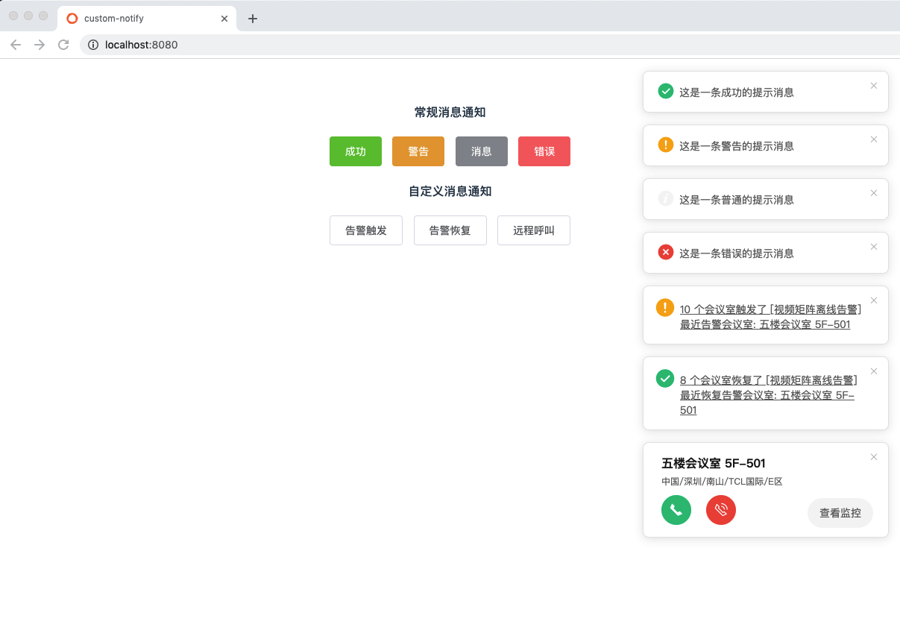

# customNotify
自定义全局 notification

### Demo


---

### Usage
```javascript
// 常规消息
this.$customNotify({
  type: 'success', // success | warning | info | error
  message: '这是一条消息提示'
});

// 自定义消息
this.$customNotify({
  type: 'alarmTrigger',
  duration: 0, // duration 为 0 表示不自动消失
  data: {
    title: `6 个会议室触发了 [视频矩阵离线告警]`,
    subtitle: '最近告警会议室: 五楼会议室 5F-501',
    titleCallback: () => {
      console.log('##### alarmTrigger titleCallback #####');
    },
    subtitleCallback: () => {
      console.log('##### alarmTrigger subtitleCallback #####');
    }
  }
});

this.$customNotify({
  type: 'remoteCall',
  duration: 0,
  shake: true, // 开启 shake 动画
  data: {
    title: `五楼会议室 5F-501`,
    subtitle: '中国/深圳/南山/TCL国际/E区',
    titleCallback: () => {
      console.log('##### alarmTrigger titleCallback #####');
    },
    subtitleCallback: () => {
      console.log('##### alarmTrigger subtitleCallback #####');
    }
  }
});
```
